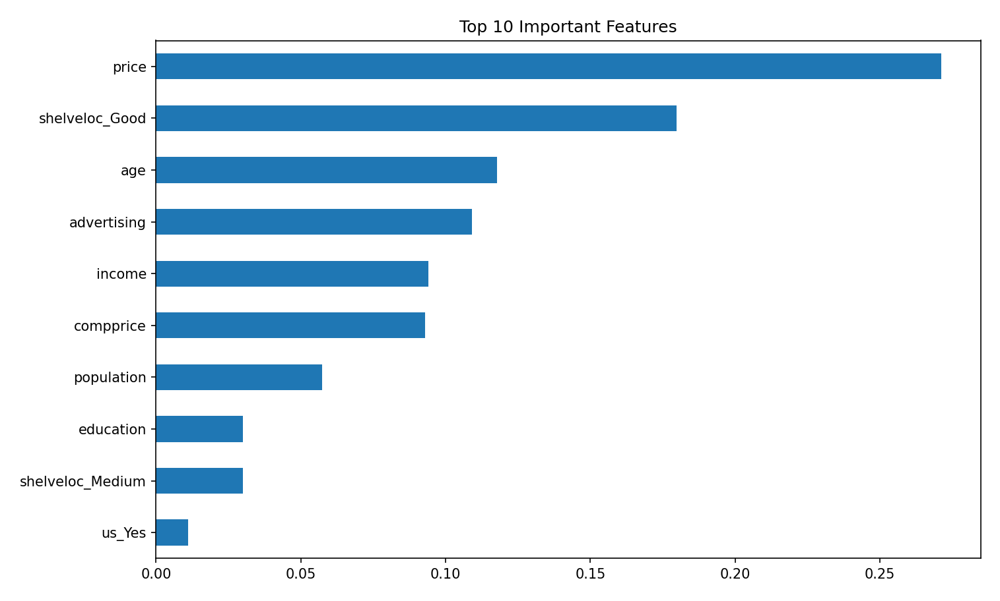

# 🌲 Random Forest Sales Segmentation Analysis

A machine learning project that identifies **key factors driving high sales** for a manufacturing company using a **Random Forest Classification model**.  
The project focuses on **exploratory data analysis, target engineering, and feature importance–driven business insights**.

---

## 📌 Table of Contents
- [📌 Project Overview](#project-overview)
- [📂 Dataset Description](#dataset-description)
- [🧠 Problem Statement](#problem-statement)
- [🔍 Exploratory Data Analysis (EDA)](#exploratory-data-analysis-eda)
- [🎯 Target Variable Engineering](#target-variable-engineering)
- [🌲 Model Building](#model-building)
- [📈 Model Evaluation](#model-evaluation)
- [🧠 Insights from Feature Importance](#-insights-from-feature-importance)
- [📊 Business Insights & Interpretation](#business-insights--interpretation)
- [✅ Conclusion](#conclusion)
- [🛠️ Tech Stack](#tech-stack)
- [📂 Repository Structure](#repository-structure)
- [👨‍💻 Authors and Contact](#-authors-and-contact)

---

## 📌 Project Overview

The objective of this project is to help a manufacturing company understand  
**which attributes or segments lead to high sales performance** across different store locations.

A **Random Forest Classification model** is used after converting continuous sales values into **categorical segments (High / Low)**, enabling better business interpretation.

---

## 📂 Dataset Description

The dataset consists of approximately **400 records and 11 variables**:

| Feature | Description |
|------|------------|
| Sales | Unit sales (in thousands) |
| CompPrice | Competitor’s product price |
| Income | Community income (in $000s) |
| Advertising | Advertising budget (in $000s) |
| Population | Population size (in $000s) |
| Price | Company product price |
| ShelveLoc | Shelf location quality (Bad, Medium, Good) |
| Age | Average age of population |
| Education | Education level |
| Urban | Urban or rural store |
| US | Store located in the US |

---

## 🧠 Problem Statement

A manufacturing company wants to answer:

> **Which factors or attributes cause high sales?**

### 🎯 Modeling Approach
- Convert sales into **categorical classes**
- Perform **EDA** to understand data behavior
- Train a **Random Forest Classification model**
- Interpret results using **feature importance**

---

## 🔍 Exploratory Data Analysis (EDA)

### Key Observations
- No missing values in the dataset
- Advertising and Income show a positive relationship with Sales
- Price shows a negative relationship with Sales
- Shelf Location significantly influences sales performance

EDA helped guide both **feature selection** and **target engineering strategy**.

---

## 🎯 Target Variable Engineering

To improve classification quality, sales were divided into **clear High and Low segments** by removing ambiguous mid-range values.

### Why this was done:
- Middle-range sales values often overlap
- Overlapping values introduce label noise
- Removing ambiguity creates **cleaner decision boundaries**

This step significantly improved model performance and interpretability.

---

## 🌲 Model Building

- Algorithm used: **Random Forest Classifier**
- Target variable: `Sales Category (High / Low)`
- Data split: **80% training / 20% testing**
- Categorical features encoded using **One-Hot Encoding**

Random Forest was chosen because:
- It handles non-linear relationships
- It is robust to outliers
- It provides interpretable feature importance

---

## 📈 Model Evaluation

### Performance Summary
- **Accuracy:** 92%
- **Precision (High Sales):** 1.00
- **Recall (Low Sales):** 1.00
- **F1-score:** 0.92

The model performs exceptionally well on **clearly defined sales segments**.

---

## 🧠 Insights from Feature Importance



### 🔑 Key Observations
1. **Price** is the most influential feature  

   - Higher price strongly reduces sales probability

2. **Good Shelf Location** has a major positive impact  
   - Better visibility leads to higher customer engagement

3. **Age** influences purchasing behavior  
   - Certain age groups are more responsive to the product

4. **Advertising** significantly boosts sales  
   - Confirms marketing spend effectiveness

5. **Income & Competitor Price** play secondary but important roles  

6. **US and Education** have relatively lower influence  
   - These variables contribute marginally compared to pricing and placement

---

## 📊 Business Insights & Interpretation

### What drives high sales?
- Competitive pricing
- Strong advertising presence
- Premium shelf placement
- Targeting the right demographic segments

### Strategic Recommendations
- Optimize pricing strategy relative to competitors
- Increase advertising in high-income regions
- Negotiate for better shelf placement
- Focus efforts on high-impact variables rather than low-impact demographics

---

## ✅ Conclusion

The Random Forest model successfully identifies **critical factors influencing high sales** with strong accuracy and clear interpretability.

By combining **EDA, target engineering, and feature importance analysis**, the model delivers actionable insights that can directly support business decision-making.

---

## 🛠 Tech Stack

- Python
- Pandas, NumPy
- Matplotlib, Seaborn
- Scikit-learn
- Jupyter Notebook

---

## 📂 Repository Structure

```
random-forest-sales-segmentation/
│
├── images/
│   ├── sales_distribution.png
│   ├── shelf_location_sales.png
│   ├── confusion_matrix.png
│   └── feature_importance.png
│
├── data/
│   └── Company_data.csv
│
├── notebooks/
│   └── Random_Forest_Sales_Segmentation.ipynb
│
├── reports/
│   └── Random_Forest_Sales_Segmentation.html
│
├── README.md
└── requirements.txt

```

---

## 👨‍💻 Author & Contact
**Author:** Mohd Walid Ansari  
**Email:** [walidmohd2532001@gmail.com](mailto:walidmohd2532001@gmail.com)  
**GitHub:** [mohdwalid253](https://github.com/mohdwalid253)   
**LinkedIn:** [Mohd Walid Ansari](https://www.linkedin.com/in/mohdwalidansari/)